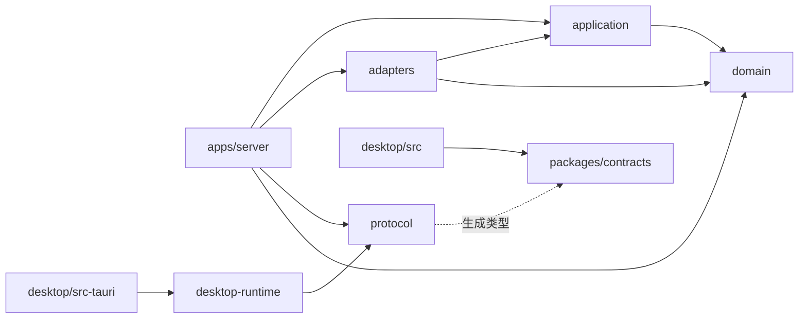

# MeowLive2D

面向 AI Live2D 直播的模块化工程：Linux / WSL 主服务使用 Rust，控制面板使用 React + TypeScript，Windows 执行层使用 Rust，语音推理复用独立 GPT-SoVITS 服务。

已实现文字播报、VTube Studio 口型、M2 Agent 互动和 M3 哔哩哔哩官方直播接入的工程链路：面板输入人工语音、模拟事件或连接直播间，Rust 主服务选择候选事件、调用 LLM 与 GPT-SoVITS，独立客户端播放 PCM 并按设备能量驱动口型。支持事件去重、连续礼物分组、人设与话题、主动发言冷却、立即停止、断线暂停和独立 VTS 授权重连。用户已确认 Windows 发声；真实平台授权、直播事件和模型口型仍待实测；云端 DeepSeek 与 GPU TTS 的软件链路已实测；M4 已接入角色档案、模型包校验安装、VTS 热键映射预览、参考 WAV 上传、音色试听及资源持久化。M5 已接入微调任务、成对权重版本与试听启用、本地 LLM 配置及资源测量；真实训练与离线联合硬件验收尚未通过。M6 已接入 Windows Tauri 薄外壳、OBS v5 状态/场景/录制控制、持续观测工具与交付验收手册；项目仍在开发，不提供 Release 或安装包。

## 工程结构

```text
MeowLive2D/
├── apps/
│   ├── server/                    # Linux 主进程：组装、配置和传输入口
│   │   └── src/
│   │       ├── main.rs
│   │       ├── bootstrap.rs       # 依赖组装及进程生命周期
│   │       ├── config.rs
│   │       └── transport/         # HTTP、WS、跨端执行适配、DTO 映射
│   └── desktop/
│       ├── src/
│       │   ├── app/               # React 页面组装和全局样式
│       │   ├── features/          # live、agent、characters、voices、connections
│       │   ├── services/          # server 与 desktop 客户端边界
│       │   └── shared/            # 纯展示组件与通用纯函数
│       └── src-tauri/             # 桌面Tauri 2 Windows 薄外壳
├── crates/
│   ├── domain/                    # 业务对象、状态与不变量
│   ├── application/               # Agent、调度及用例；ports 定义外部能力
│   ├── protocol/                  # 跨进程 DTO 的唯一来源
│   ├── adapters/                  # 模型、直播源、存储与训练实现
│   └── desktop-runtime/           # 播放、VTS、OBS、口型和 Windows 素材
├── packages/
│   └── contracts/                 # 前端协议类型出口，从 Rust 生成
├── config/                        # 可提交的配置示例
├── scripts/                       # 目录索引生成、用途登记和工具测试
├── tests/                         # 契约、集成、端到端和回放素材的分工说明
├── docs/                          # 本地架构与计划，按项目约定忽略提交
├── Cargo.toml / Cargo.lock        # Rust workspace 与依赖锁
└── package.json / package-lock.json # npm workspaces 与依赖锁
```

每个受维护目录另有 `DIRECTORY.md`，递归展示实际文件与用途。从根 [目录索引](DIRECTORY.md) 可以逐层浏览；同步维护规则见 [AGENTS.md](AGENTS.md)。

## 模块依赖

箭头表示“依赖于”，应用入口负责选择和注入实现。



- `domain` 不依赖框架、网络、数据库、平台 SDK 或通信 DTO。
- `application` 定义外部能力接口；`adapters` 实现这些接口。业务层不按厂商名称选择实现。
- `protocol` 与领域类型分开演进；主服务的 `transport/mapping.rs` 负责转换。
- `desktop-runtime` 不导入 Tauri，不调用 LLM，也不决策直播内容；外壳只组装执行库并转发命令。
- 前端依赖方向为 `app → features → services / shared`。功能之间通过公共入口协作，跨功能流程由 `app` 组装；`shared` 不反向导入业务功能。
- DTO 与协议版本定义在 `crates/protocol`，`npm run contracts:generate` 生成 TypeScript；`contracts:check` 检查结果一致性。
- 主服务 worker 只做 I/O 驱动与 DTO 映射，队列、容量、取消和回执合法性均在 application；桌面运行时只依赖 protocol。

## 默认运行方式：Linux 网页 + Windows 执行端

Windows 用户可以在实际克隆位置打开 `launchers/`，双击 `start-windows.cmd`：入口先检查 WSL2，未安装时显示安装步骤，有 WSL2 时启动项目并打开浏览器。在 WSL 项目目录运行 `explorer.exe ./launchers` 即可打开正确位置，无需固定发行版、用户名或安装目录；详见 [启动入口](launchers/README.md)。

在 Linux / WSL 终端也可以执行：

```bash
git clone https://github.com/KafuuChinoQwQ4/MeowLive2D.git
cd MeowLive2D
./launchers/start.sh
```

控制面板会尝试自动打开；没有弹出浏览器时，手动访问 `http://127.0.0.1:1420`。首次先进入 **环境与模型**：自动扫描本地目录与 Hugging Face 缓存；已有完整 GPT-SoVITS v2 可选择，缺少模型可从“下载模型”下载。目录提供 21 个公开模型及版本，含进度、取消、校验和失败重试；目前 v2 可启用，其余明确标记“需适配”，下载文件不会自动安装各引擎。然后在导航“启动与运行”页依次打开 **主服务**、**TTS 语音引擎**、**Windows 执行端** 三个滑动开关，等待服务“运行中”、执行端“已连接”。首次 TTS 加载可能需要数分钟。新检出没有预置参考音频、个人音色或已训练版本。先在“角色与音色”上传自己的参考 WAV 和文本，再到“训练与离线”导入素材并训练、试听和保存；选择自己的音色后再使用语音与 Agent。保持这一个终端打开；退出时关闭开关或按 Ctrl+C，启动器会回收它启动的服务。

控制台使用粉色渐变、半透明亚克力卡片和柔和阴影，并提供侧栏导航，点击后仅显示对应功能；小屏为顶部横向导航。已打开页面的草稿、所选文件与在途操作在切页时保留，首次访问才加载该页。浏览器前进/后退可切页，首页一直保留服务开关。

`npm start` 与上述入口等价，但不自动安装缺失的依赖；`npm run dev` 保留为仅开发网页的入口，需自行管理服务。启动器首启创建 `config/local/launcher.json`，本机已有引擎和主服务配置可直接使用。缺少环境时，页面显示需修改的配置与日志位置；另一台机器仍须准备 Rust、Node.js、Python 与 GPT-SoVITS 引擎依赖；模型权重可在网页下载。

日常开发保持在 Linux / WSL。Windows 仅运行独立的 `meowlive-client.exe`、VTube Studio 与 OBS；不需要复制整个仓库或安装 Node.js / Rust。

Windows 执行端负责设备播放、口型与本机 VTS/OBS 控制。源码仓库不含 `meowlive-client.exe` 或本机配置；需自行构建 Windows 执行端，再将程序及从 `config/desktop.example.toml` 复制并调整的 `desktop.local.toml` 放到项目 `target/windows-client/`。第三个开关通过 WSL2 在 Windows 后台运行该程序。可在 Windows Rust MSVC 环境运行 `cargo build -p meowlive-desktop-runtime --bin meowlive-client --release --locked`；构建结果位于该检出的 `target/release/`。Tauri 是可选桌面窗口封装。构建和运行数据都不会提交，当前不发布 Release。

面板中的项目路径相对于项目根目录显示；外部用户目录以 `~/` 显示，其他外部位置以相对项目的路径显示。启动器根据实际检出目录解析运行路径，无需以 `/root` 开头。私有 launcher JSON 的相对路径基准是项目根；Rust TOML 中的资源目录则相对于该 TOML 所在目录。需要绝对路径的训练引擎、Python 和权重字段按实际环境填写，不复制开发者机器的路径。

## 开发与检查

基线为 Rust 1.85+（2024 edition）、Node.js 22.12+、npm 10+。本次骨架在 Rust 1.98.0、Node.js 26.2.0、npm 11.16.0 上验证。

```bash
npm ci
npm run dev
```

前端开发入口为 `http://127.0.0.1:1420`。浏览器模式连接 Rust 主服务，播放任务由独立客户端持有；页面关闭不停止播音。

```bash
npm run check
npm run build
cargo clippy --workspace --all-targets --locked -- -D warnings
```

`npm run check` 包含目录索引、维护工具测试、Rust 格式/编译/测试、契约一致性、TypeScript 类型检查和前端组件测试；`npm run build` 生成前端产物。它们不验证真实设备、模型效果或直播链路。

## 文件变更后的目录维护

新增、修改、删除或移动文件时，同步 `scripts/directory-descriptions.json` 中相应路径的用途，然后运行：

```bash
npm run tree:update
npm run tree:check
```

文件用途未变化时保留原说明，但仍需刷新索引中的内容指纹。用途发生变化时由修改者更新说明；脚本负责发现缺项、残留路径和过期索引。生成的 `DIRECTORY.md` 不直接手改。

`docs/` 的说明独立存于 `docs/directory-descriptions.json`，同一命令会递归维护；根索引只展示此本地目录的入口，避免其 Git 忽略状态影响其他环境。依赖、构建产物和运行数据不生成索引。

## 配置与外部服务

`config/*.example.toml` 已由对应 Rust 入口解析并校验。当前包含语音、连接、VTS、口型、Agent、兼容 LLM 和资源存储参数。机器配置使用 `*.local.toml` 或 `config/local/`，两者都被忽略；LLM 密钥通过主服务环境变量读取，VTS 授权文件仅存于本机，不写入前端源码或日志。

GPT-SoVITS 的代码、Python 环境和模型权重保持独立。受管启动器当前接入 GPT-SoVITS v2、单推理实例；其他版本可下载，尚需单独适配。服务端通过适配器调用已有 HTTP 服务，本工程不复制语音引擎代码。

`docs/` 是被忽略的本地文档目录，不随源码分发。克隆后的基础协作规则以本 README、[AGENTS.md](AGENTS.md) 和源码模块注释为准。

## 启动文字播报

在项目根目录分别启动主服务、桌面客户端和前端：

```bash
# 主服务；参考素材未填写时仍可启动，但播报会显示配置错误
npm run start:server -- --config config/server.example.toml

# Windows：真实默认音频设备
npm run start:client -- --config config/desktop.example.toml

# Linux 联调：显式静音模拟，仅核对协议、队列与回执，不输出声音
npm run start:client -- --config config/desktop.example.toml --simulate

npm run dev
```

真实合成前，将示例复制到 `config/server.local.toml`，填写 `speech.reference_audio`（GPT-SoVITS 能读取的 Linux 路径）、参考文本及语言，并使用 `--config config/server.local.toml`。语音引擎保持独立运行；启动本项目不会修改引擎权重或配置。面板使用当前已选择的音色；未配置参考素材、未上传音色时不会提供可用默认声音。每次最多 500 个 Unicode 字符。

面板默认连接 `http://127.0.0.1:19600`，可用 `VITE_MEOWLIVE_SERVER_URL` 调整；服务端 `allowed_origins` 须包含面板来源。Windows 客户端的 `server_url` 按 WSL 网络地址配置。默认绑定 loopback；当前主服务与执行端桥接尚未启用令牌认证，只适合本机或受信网络，勿直接暴露到公网。

HTTP 接口为 `GET /api/status`、`POST /api/speech`、`POST /api/stop`。控制 `/ws/control` 与音频 `/ws/audio` 分开；仅一个执行端可以配对。停止提升生成代次并取消在途任务；无法立即中止的外部 GPU 计算结果会被丢弃。已下发任务断线记为 `unknown`，重连不自动重播。历史有界且仅在内存保存，重启生成新的 session。

首版请求整句 WAV，适配器校验 PCM16 后按二进制 PCM 分片下发；不宣称已达到流式首包延迟目标。Windows 后端以设备播放时间决定 started/completed，网络数据结束不能直接标记播放完成。

## 启用 VTube Studio 口型

将 `config/desktop.example.toml` 复制为 `config/desktop.local.toml`，启用 `[vtube_studio].enabled = true`，在 VTS 打开插件 API，并用该配置启动客户端。首次在 VTS 中允许 `MeowLive2D` 插件连接，然后把新建的 `MeowMouthOpen` 输入（0..1）映射到模型嘴部开合参数。授权令牌默认写入 `config/local/vts-token.json`，相对路径以配置文件所在目录为准。

口型按设备播放能量计算，支持静音阈值、增益和平滑。停止、完成、设备失败或主服务断线会发布零值；VTS 失联后单独重连，恢复先闭嘴，不重放旧值。授权被拒绝时客户端不会反复请求弹窗。连接状态目前显示在桌面进程日志，参数说明与重新授权步骤见 [配置说明](config/README.md)。

自动化测试包含受控 VTS WebSocket 服务、真实客户端进程和静音模拟播放，覆盖授权、限频、停止、超时及重连；这些测试不替代 Windows 音频、真实模型映射和 OBS 录制验收。实机步骤见 [端到端验证](tests/e2e/README.md)。

## 启用 Agent 互动

在 `config/server.local.toml` 的 `[llm]` 同时填写提供商 API 根地址与模型名。将密钥放入主服务环境变量 `MEOWLIVE_LLM_API_KEY`，保留 `api_key_env` 为变量名；无认证本地服务可显式清空变量名。适配器调用兼容的 `/chat/completions`，默认请求 JSON 输出；不支持 JSON 模式的服务可关闭 `json_mode`，响应仍须通过结构化校验。模型必须支持本文本聊天协议，尚未实际验证所有兼容提供商。

重启主服务、连接桌面执行端，在面板中保存人设/话题，然后点击“恢复 Agent”。默认启动暂停，默认关闭主动发言。可发送模拟聊天或礼物，也可把 [示例事件](tests/fixtures/agent-events.json) 整个 JSON 数组粘贴到事件回放。重复 ID 在当前去重窗口内不会重复入队；同一观众的连续同种礼物一起选择并保留原始事件关系。

Agent 只在语音队列空闲时开始下一轮决策，模型可选择候选事件子集或忽略全部。暂停及保存设置取消在途决策，已提交语音继续；“立即停止”同时暂停 Agent、清空待选事件并停止播音。桥接断线会暂停 Agent，重连后手动恢复。事件只有在播放完成回执到达后才记为完成；取消、失败和未知结果不会写入已完成对话记忆。

设置、事件、去重和对话记忆目前有界保存在内存；面板保存设置不写回 TOML，服务重启后恢复文件配置和暂停状态。事件回放按本次接收时间调度，不恢复原始间隔。参数范围、重试与协议说明见 [配置说明](config/README.md)；实际模型质量、费用和流式首段延迟尚未测量。


## 连接哔哩哔哩直播间

首个平台适配器使用[哔哩哔哩直播开放平台](https://open-live.bilibili.com/document/)的项目授权与事件长连接。需要可用的开放平台应用 ID、开发者访问密钥及主播身份码；直播间房间号由授权响应返回，单填房间号不能完成接入。接口实现参考[官方 C# SDK](https://github.com/bilibili-openplatform/OpenLive_CSharpDemo)。

在 `config/server.local.toml` 设置 `[live].enabled = true` 和 `app_id`；三个 `*_env` 字段保留为环境变量名，在启动主服务的环境中设置 `MEOWLIVE_BILIBILI_ACCESS_KEY_ID`、`MEOWLIVE_BILIBILI_ACCESS_KEY_SECRET`、`MEOWLIVE_BILIBILI_IDENTITY_CODE`。缺少凭据时人工播报与模拟事件仍可用，直播面板会显示未配置。凭据不经过浏览器，也不写入示例或版本库。

重启主服务，点击面板“连接直播间”。成功后显示房间与事件计数；连接执行端并手动恢复 Agent 后，弹幕和礼物会进入已有回应链路。项目心跳、WebSocket 心跳与重连由后台任务维护，关闭页面不结束连接。“断开直播间”停止接收并结束平台项目；主服务退出也会尝试清理会话。鉴权失败需修正配置后再手动连接。

平台失联或手动断开会暂停 Agent、取消未提交的决策，已排入语音队列的发言仍按执行回执记录；平台重连成功后需手动恢复 Agent。“立即停止”仍用于停止播音和清空待回应事件，不会断开平台。面板的接收、去重、丢弃与重连计数保持到主服务重启；它们不等于已完成回应数，回应结果在 Agent 历史中查看。

事件 ID 带平台和房间前缀，重连重送复用原始消息 ID；去重窗口有界且不跨服务重启。满队列事件会被丢弃并计数，不会拖慢平台心跳。HTTP 入口为 `GET /api/live`、`POST /api/live/connect`、`POST /api/live/disconnect`，沿用主服务来源校验。

自动化验证使用受控平台服务；正式使用前仍须按 [E2E 验收步骤](tests/e2e/README.md)完成真实授权、弹幕、礼物、断网与 Windows 播放验收。


## M4：角色与音色资源

启动主服务、Windows 执行端和前端后，面板的“音色管理”支持上传 3–10 秒的 PCM16 WAV（8–48 kHz、单声道或双声道、非静音、最多 2 MiB），手工填写对应参考文本与语言。上传后可以试听，或设为当前音色。试听沿用正式播报队列，可以在播报面板停止，并以设备完成回执判断结果。手动播报使用 `active` 音色别名，Agent 使用当前音色；已经入队的任务仍持有原音色 ID。

`[resources].directory` 相对于服务配置文件，默认 `../data/resources`。档案保存于 `catalog.json`，参考音频保存于 `references/<音色ID>.wav`，重启后保留；服务端查询会标出丢失的参考文件。若 GPT-SoVITS 在容器或另一主机，须共享整个资源目录，并将 `engine_directory` 设置为引擎中的 Linux 绝对路径。面板从不把 Windows 文件路径传给 TTS。上传参考音频后可直接进行推理克隆；权重微调另由下述 M5 训练任务执行。

“角色管理”先刷新 VTS 模型、保存角色，再选择并加载。每个角色关联一个音色、口型输入参数和能力热键。切换前须停止当前播报，切换会暂停 Agent；确认画面和音色后手动恢复。口型输入默认 `MeowMouthOpen`，在 VTS 模型设置内将其映射到真正的 Live2D 嘴部参数。表情/动作映射保存后逐项预览，成功才记录验证状态；缺少主热键会尝试配置的替代热键，否则跳过并报告原因。修改档案会重新要求验证。当前 Agent 仍生成文本回复，映射预览为后续自动表演提供已验证能力，不让模型直接选择任意 VTS API。

在 Windows 配置的顶层设置 `model_directory` 为 VTS 安装中的 `VTube Studio_Data/StreamingAssets/Live2DModels` 目录。“从本机导入模型”会在执行端打开目录选择器，接受已解压的导出模型包并检查 `.model3.json`、`.moc3`、纹理及清单引用。自动识别单层包装目录，不覆盖同名安装；安装后重启 VTS，再刷新模型列表。API 加载只切换 VTS 已识别的模型，文件安装由本地执行库完成。

也可以先用独立工具校验或明确指定安装位置：

```bash
cargo run -p meowlive-desktop-runtime --bin meowlive-model -- validate /path/to/exported-model
cargo run -p meowlive-desktop-runtime --bin meowlive-model -- install /path/to/exported-model /path/to/Live2DModels model-name
```

Windows 使用相同子命令与 Windows 路径。目录选择器、真实模型表情和声音仍需 Windows/VTS 实机验收；Linux 自动化可验证文件安装及受控 HTTP/WS 链路。M4 将控制协议升为版本 2，主服务、前端与执行端须一起更新。

资源 HTTP 入口为 `GET /api/resources`、`POST /api/voices`（multipart 的 `metadata` JSON 与 `audio` WAV）、`POST /api/voices/select`、`POST /api/characters/save`、`POST /api/characters/select`、`POST /api/characters/preview`。`POST /api/desktop/resources` 仅提供模型/热键查询和本机目录选择；模型加载和热键触发须经过角色档案。

### M5：音色微调与离线预设

面板已提供训练片段导入、逐片文本审核、任务进度/取消、完成版本试听、音色保存与切换。每个任务绑定已有音色，要求 2–32 个 3–10 秒、8–48 kHz、PCM16 非静音 WAV，单片不超过 2 MiB、总量不超过 32 MiB。文本需人工核对，不能含换行或 `|`。GPT / SoVITS 轮次各为 1–20；当前 GPU 预设固定 v2、batch 1、FP16、SoVITS segment_size 10240，并在项目工作副本禁用 AdamW foreach 以限制优化器瞬时内存。该预设不代表 6 GB GPU 已验收可用。

训练完成后，在“训练与离线”生成版本试听，听取并勾选确认，再点击“保存音色”。音色使用训练名称保存，参考音频与成对模型保留在主服务本机；关闭页面或重启主服务后仍可从页面顶部“已保存音色”选择，点击“使用所选音色”同时启用对应模型版本并设为当前参考音色，文字播报（`active`）与 Agent 随后使用该音色。同一参考音色的多个训练版本可分别保存并来回切换，无需重新训练或重复试听。保存不会自动切换当前声音；直接“启用此版本”也会保存。已有启用版本会兼容为已保存音色，未确认版本仍需试听确认；文件缺失的版本保留记录但不能选用。“角色与音色”页提供已保存音色的跳转入口。

在 `server.local.toml` 的 `[training]` 设置 `enabled=true`、`python`、`engine_root`。任务仅在直播断开、播报及决策结束、本机推理端口关闭且 GPU 已释放时开始；项目不终止其他软件的推理进程。阶段依次为文本/音频/语义预处理、SoVITS、GPT、权重校验。取消等待整个训练子进程组退出。重启把未完成任务标为中断，需新建任务；SIGINT/SIGTERM 会主动清理，强制 SIGKILL 或主机故障不能保证子进程清理。

训练数据保存在 `training.directory/jobs/<任务ID>/`；固定成对产物 `artifacts/gpt.ckpt`、`artifacts/sovits.pth` 与 SHA256 清单绑定同一版本。最多保留 64 个任务；`engine.log` 与 `stages.log` 是仅在服务器本地读取的有界诊断日志。预处理即使退出 0，缺少任一片段输出仍会失败；模型缺失、被替换或 hash 不匹配时不能试听或启用。任务索引使用原子替换，未宣称断电恢复能力。

试听/启用必须使用独立受管推理实例，避免权重 API 写入原安装的推理配置：

```bash
./data/environments/gpt-sovits/bin/python scripts/start-managed-inference.py \
  --engine-root ./data/engines/GPT-SoVITS \
  --data-dir ./data/inference --port 9880
```

以上命令假定已自行将引擎及其 Python 环境准备在示例相对目录，其他安装位置请替换为自己的路径。随后配置 `training.managed_inference=true` 和默认 v2 `default_gpt_weights`、`default_sovits_weights` 的绝对路径。此开关是对该实例的显式声明，请勿指向共享的其他推理实例。生成版本试听返回浏览器 WAV；听取并勾选确认后方可启用。每次普通音色合成都会加载对应成对版本或默认权重，切换失败不生成语音。已保存音色可在直播连接保留时切换，需等待当前播报、推理及资源修改结束；切换保持 Agent 原有暂停或运行状态。停止前台请求后，尚在执行的权重/TTS 事务会继续保持忙碌，结束后才准入其他 GPU 操作。

`config/offline.example.toml` 提供本地 LLM 配置模板，复用 OpenAI-compatible 接口并强制 LLM/TTS 使用回环 IP、不读云端密钥、token ≤1024、不自动重试。面板“测量本地 LLM 与 TTS”运行真实模型决策→语音合成，采样 NVIDIA GPU 显存并保存 `measurement-<时间>.json`。只有采样覆盖实际运行、峰值 ≤5120 MiB、余量 ≥512 MiB、总耗时 ≤30 秒才显示本次实测通过；重启后需重新测量，训练或版本启用也会清除旧标记。这是单次服务器链路测量，不能替代 Windows VTS/OBS 联合测试或持续负载测试。

HTTP 接口为 `/api/training`、`/api/training/jobs`（multipart）、`/api/training/cancel`、`/api/training/audition`、`/api/training/activate` 与 `/api/runtime/preset`、`/api/runtime/measure`。机器路径不进入公开契约。

2026-09-15 本机验收：RTX 4050 Laptop 6141 MiB 上，真实三阶段预处理通过；SoVITS 训练遇到 CUDA OOM，尚无成对微调产物。受管推理使用已有 v2 预训练权重与合成测试参考音频，成功生成 32 kHz 单声道 WAV（6.82 秒，合成耗时 12.51 秒）；这只验证实际推理链路，不代表音色质量。未配置本地 LLM，离线联合测量保持未验证。该记录不包含可分发的个人音色或训练成果。

## M6：可选桌面入口、OBS 与交付验收

仅在需要开发或测试 Tauri 窗口时，Windows 安装 Rust MSVC 工具链、Node.js 和 WebView2 后，在项目目录运行 `npm ci`，再运行 `npm run desktop:dev`。桌面程序持有独立执行运行时，面板地址取自桌面 TOML 的 `server_url`。首次运行在应用配置目录创建 `desktop.toml`；显式配置可用 `npm run desktop:dev -- -- -- --config C:\绝对路径\desktop.local.toml`。关闭窗口会取消连接、停止播放并清理 VTS 口型。此入口需要主服务已启动；Linux 使用 `start:client -- --simulate` 验证。

OBS 28+ 启用 WebSocket v5 后，在执行端配置 `[obs].enabled = true`，设置密码环境变量 `MEOWLIVE_OBS_PASSWORD`，再启动执行端。面板“OBS 场景与录制”支持刷新状态、选择场景、开始/停止录制；初次打开只读状态，操作不自动重试。超时或断线后先刷新确认实际状态。音频采集源由你在 OBS 内设置；“立即停止”停止播报，不停止录制。

`npm run acceptance:observe -- --duration-seconds 600 --execution simulated` 可收集十分钟只读状态记录。报告排除文本、模型回复和密钥，初始历史不算新增任务，HTTP 查询延迟与物理发声延迟分别记录。`npm run check` 包含观测工具测试。部署步骤见 [桌面入口](apps/desktop/src-tauri/README.md)、[配置说明](config/README.md)；实机验证见 [E2E 清单](tests/e2e/README.md)。本机验收记录仅保存在被忽略的 `docs/`。

2026-09-15 实际测试：两次 DeepSeek 决策接入已有 v2 预训练 GPT-SoVITS，聊天及合并礼物共两次播报均收到模拟端完成回执；事件去重、停止和重连后暂停符合预期。参考音频为管线测试素材，不代表角色音色质量。已在 Linux 交叉编译 Windows x86_64 独立执行端 release 程序并核查导入 DLL；Windows Tauri 编译/窗口、真实发声、VTS/OBS 声画、真实直播仍由用户检验。M5 训练 OOM 与未配置本地 LLM 的限制继续保留，没有生成安装包或发布。

## 仓库与许可证

本仓库仅分发源代码、测试、依赖锁文件及不含凭据的配置模板。`config/local/`、私有配置、`.env*`（除 `.env.example`）、本地 `docs/`、录音及训练数据、模型权重、日志、依赖缓存和构建输出不进入 Git。首次运行后在本机填写环境与凭据；不要把密钥写进源码或公开模板。

项目源码采用 [MIT 许可证](LICENSE)，版权所有 © 2026 KafuuChinoQwQ4。第三方依赖、GPT-SoVITS 等外部引擎、下载的模型权重、Live2D 模型和用户上传的音频分别遵循其原许可证或授权；项目许可证不授予这些素材的权利。项目仍在开发，目前仅提交源码，不发布 Release。
